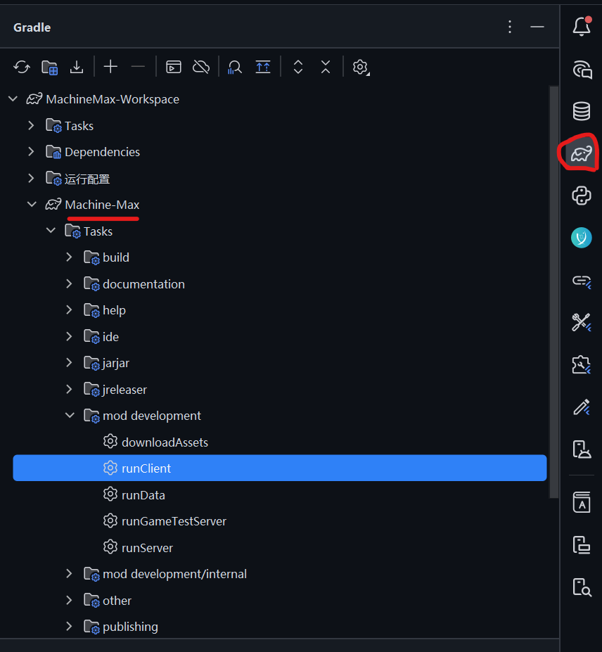
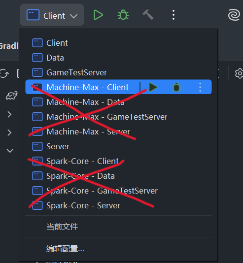
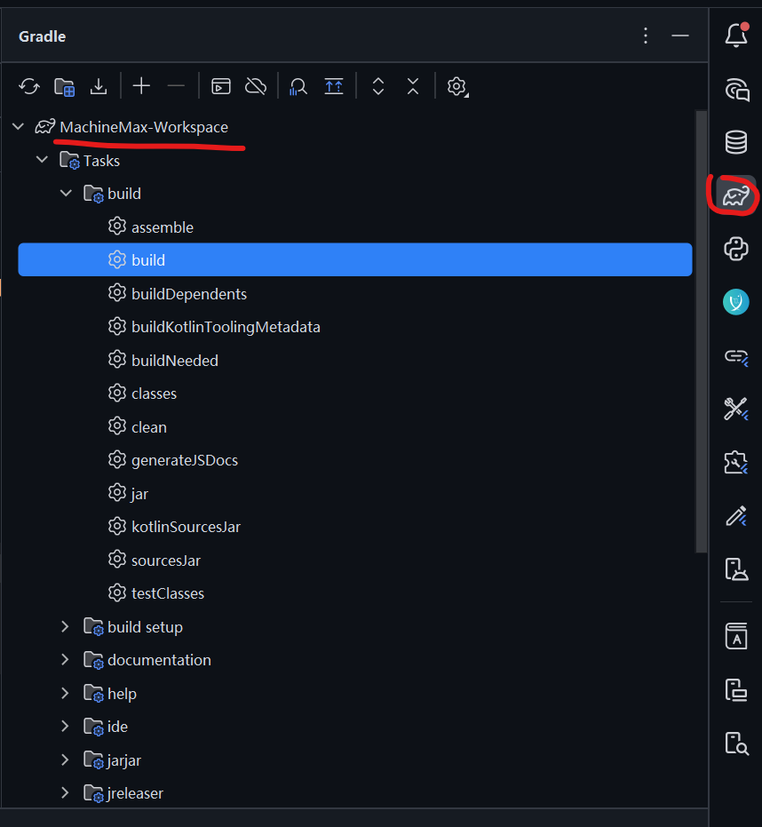
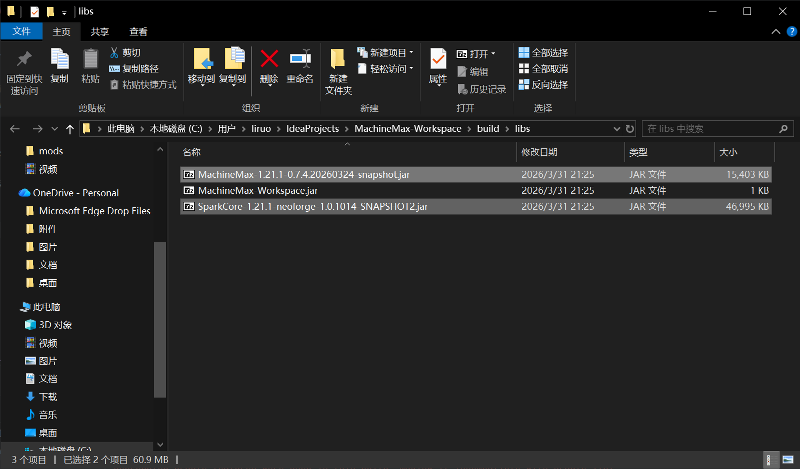

# MachineMax-Workspace

**Minecraft 模组 MachineMax 的开发工作空间。**

这是一个用于集中管理和开发 **MachineMax** 系列模组及相关库模块的集成项目。它使用 Git 子模块来组织各个独立的模块仓库，方便进行统一构建、测试和版本控制。

## 项目概述

此工作空间（Workspace）旨在提供一个开箱即用的开发环境，包含了 **MachineMax** 主模组及其可能依赖的库、前置模组或工具模块。通过子模块管理，开发者可以轻松同步所有相关组件到指定的兼容版本。


| 模块名称  | 介绍                                     | 职责   |
| :--- |:---------------------------------------|:-----|
| [Machine-Max](https://github.com/Sweetzonzi/Machine-Max) | 一款支持高度自定义的Minecraft载具模组，拥有拟真的物理交互      | 主体模组 |
| [Spark-Core](https://github.com/SolarMoonQAQ/Spark-Core) | 一款基于Minecraft的Lib模组，目标是在MC内打造一个专属的游戏引擎 | 物理引擎 |


## 快速开始

请按照以下步骤获取完整的项目代码。

### 方式一：一键克隆（推荐）

此命令会在克隆主仓库的同时，自动初始化并更新所有子模块，是最快捷的方式。

```bash

git clone --recurse-submodules https://github.com/Sweetzonzi/MachineMax-Workspace.git
cd MachineMax-Workspace
```

### 

### 方式二：分步克隆

如果您已经通过其他方式（如GitHub Desktop）克隆了主项目，但未包含子模块，请执行以下命令来补全所有子模块依赖。

```bash

# 进入项目根目录
cd MachineMax-Workspace

# ！重要步骤：初始化并拉取所有子模块
git submodule update --init

# 如果需要拉取的子模块内部还嵌套了子模块，请使用：
# git submodule update --init --recursive
```

## 

## 构建与运行

1. **Gradle 同步**：完成代码拉取后，您需要让构建工具（Gradle）同步项目依赖。在项目根目录执行以下命令，或直接在 IDE 中打开项目并等待其自动同步。
   
   ```bash
   
   # 在 Unix-like 系统 (Linux/macOS) 或 Windows PowerShell 中
   ./gradlew tasks
   
   # 在 Windows 命令提示符 (CMD) 中
   gradlew tasks
   ```
   
   此命令会下载必要的构建依赖，并验证项目配置是否正确。

2. **选择运行配置**：同步完成后，在您的 IDE（如 IntelliJ IDEA）中，您需要**选择要运行的具体模组**。
   
   * 通常，Gradle 会为每个子模块生成独立的运行配置（Run Configuration）。
   * 请在 Gradle 的运行配置下拉菜单中，选择您想要调试或测试的模组，例如 `runClient`（运行客户端）或 `runData`（运行数据生成）等任务。
     最后，记得选择你需要运行的mod
     <br><br>
   * 请不要使用IDE自动生成的运行配置，它们现在有参数配置bug
   * <br><br>


## 构建
如果您希望将工程打包进行模组发布，强烈建议使用Gradle根工程的build
<br><br>
---

<br><br>
---
运行完毕，所有包都可以在根工程的build/libs文件夹中找到。除去根工程无效的空包 MachineMax-Workspace.jar，其他都是你的模组内容或附属包

## 贡献指南

如果您希望为此项目贡献代码：

1. **Fork 本仓库**到您自己的 GitHub 账户。
2. 按照上述【快速开始】步骤克隆您 Fork 后的仓库。
3. 在特定的功能分支上进行修改。
4. 完成修改后，提交并推送至您的 Fork 仓库。
5. 向本项目的主仓库发起 **Pull Request (PR)**，并清晰描述您的更改内容。

## 许可证

此 Workspace 项目本身及各个子模块的许可证可能不同。请查看根目录及各个子模块目录下的 `LICENSE` 文件以了解具体的许可条款。
